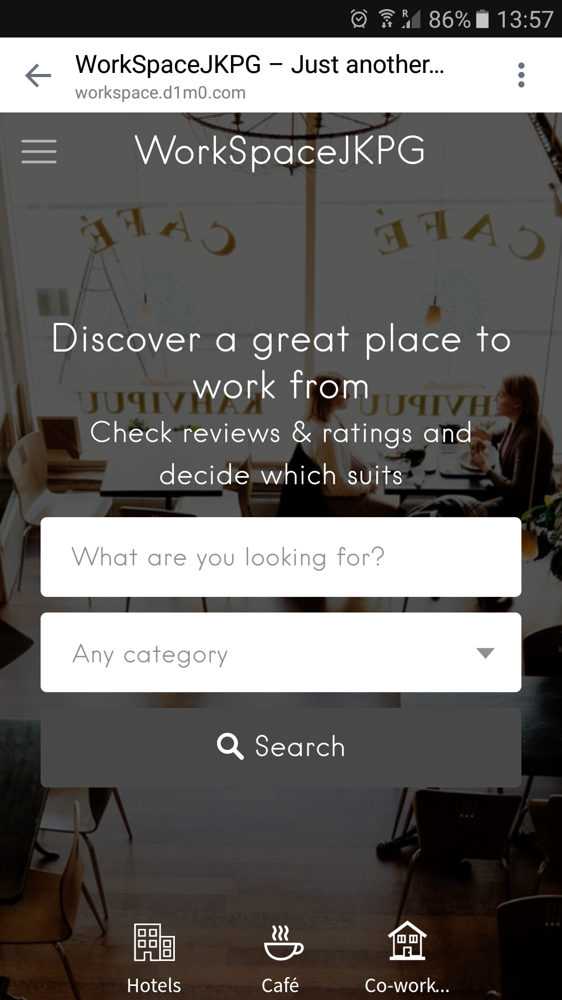

WorkSpaceJKPG <a href=""></a> 
======

### Description
Project for Innovation Days Jönköping, 2017

The [Innovation Days](https://www.facebook.com/inndays/) connect entrepreneurs with companies to foster innovation and collaboration. In a 48-hour workshop participants pitch ideas, form teams, and build prototypes that will transform companies and communities. Check the official website for more inforation [Official web](http://innovationdays.org/)

Indicating that by 2022, 60% of today’s office bound employees are expected to work remotely.

The platform helps remote workers who want to find perfect working spaces by giving them accessible ratings creating valuable information about it. Based on user ratings, consumers earn discounts.
For the platform enable businesses to receive rating based on customers experiences which in turn improve their sales and increased awareness.

More information about the project available in [docs folder](https://github.com/atanasyanew/WorkSpaceJKPG/tree/master/docs/)

### Installation
The application is containerized with Docker
```
docker-compose build
docker-compose up
```

- Application url:  **http://localhost:8001**, credentials: 
	- username: **admin**
	- password: **admin**

Application is build on top of WordPress, also phpMyAdmin included within the docker container witch can be acceses on port 8000 with the following credentials username: **user** password: **test**

### Screenshots




